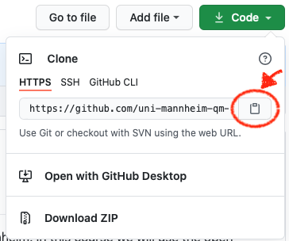
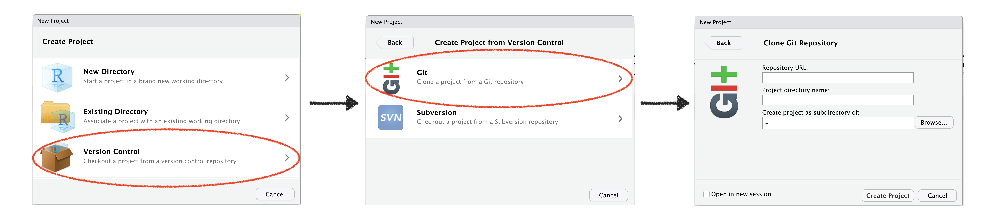

```{r setup}
# The first line sets an option for the final document that can be produced from
# the .Rmd file. Don't worry about it.
knitr::opts_chunk$set(echo = TRUE)

# The next bit (lines 50-69) is quite powerful and useful. 
# First you define which packages you need for your analysis and assign it to 
# the p_needed object. 
p_needed <-
  c("viridis", "knitr")

# Now you check which packages are already installed on your computer.
# The function installed.packages() returns a vector with all the installed 
# packages.
packages <- rownames(installed.packages())
# Then you check which of the packages you need are not installed on your 
# computer yet. Essentially you compare the vector p_needed with the vector
# packages. The result of this comparison is assigned to p_to_install.
p_to_install <- p_needed[!(p_needed %in% packages)]
# If at least one element is in p_to_install you then install those missing
# packages.
if (length(p_to_install) > 0) {
  install.packages(p_to_install)
}
# Now that all packages are installed on the computer, you can load them for
# this project. Additionally the expression returns whether the packages were
# successfully loaded.
sapply(p_needed, require, character.only = TRUE)
```

------------------------------------------------------------------------

## Content of this script

1.  General information about our lab sessions in this semester. 

-   GitHub
-   Organization of the lab sessions
-   Homework assignments

2.  We look under the hood of R Notebooks - the main tool we will work with in the lab sessions.
3.  We refresh some R Skills and have a look at Matrix Algebra in R.
4.  Some exercise to get familiar with Matrix algebra using pen and paper, and R.

Please work through sections 1-3 and do the exercises in section 4. Being familiar with matrix algebra will be essential to follow the content this semester.

------------------------------------------------------------------------

## The Lab

The general **content** of a lab session will be something like:

-   Implement/Translate the concepts and estimators from the lecture in R.
-   Explore properties of new estimators using simulations.
-   If time permits, we may discuss extensions of estimators introduced in the lecture.
-   Address open questions about the lecture. The lab will not be a second lecture, however, we are more than happy to answer your questions about the lecture--if we can.
-   Prepare for homework assignments and discuss solutions.

As a result, **you can expect** the lab sessions to prepare you to ...

-   ... translate theoretical/mathematical concepts into statistical programs.
-   ... write your own estimators.
-   ... explore properties of your own estimators using simulations.
-   ... become an advanced R programmer.
-   ... understand the technical side of statistical programs.

### GitHub workflow

As in QM, we will work with GitHub. We assume that by now you downloaded and installed R and Rstudio and have your personal GitHub account.

The course has its own page on GitHub, you can find it here: <https://github.com/uni-mannheim-aqm-2025>. This is the place where you can find all relevant materials for the lab sessions. It is also the place where you download and hand-in your homework assignments.

For those of you who are new to GitHub here is how you will get your materials:

#### Get the URL of the repo for the current week

Go to <https://github.com/uni-mannheim-aqm-2025> and click on the repository for the current week (this week, this is called `week01_welcome_back`). Now, click on the green **Clone or download** button and select **Use HTTPS** (this might already be selected by default, and if it is, you'll see the text Clone with HTTPS as in the image below). Click on the clipboard icon to copy the repo URL.



#### Import the repository in RStudio

1.  Open RStudio.
2.  Click on `File` on the top bar and select `New Project...`.



3.  Select `Version Control`.
4.  In the next window, select `Git`.
5.  In the final window, paste the repo URL you grabbed from GitHub in the `Repository URL` window. Click on `Browse` to select the folder on your computer where you want to store the project.
6.  Click on `Create Project`.

Most of your fellow students are familiar with the workflow by now, so if there are any problems, please try to help each other. If you still have problems, we are happy to help.

## Homework Assignments

There will be **six homework assignments**. All assignments will contain both theoretical questions and practical tasks that will require you to write `R` code.

The homework assignments will be challenging. Some parts will potentially be very challenging. While there will be some parts that ask you to directly apply material from the lecture and the lab, there will be other exercises that will introduce new but related material. Since this is an elective, advanced course, we expect you to approach challenges with ambition and an open mind. Please work in groups (preferably groups of three). Plan at least one day--a.k.a. 8 hours--to work through all exercises.

For every homework assignment you can get a **maximum of 20 points**. There will always be **optional exercises** that are worth **3 extra points**.

Although the homework assignments should push you towards your limits, they are not intended to frustrate you. If you cannot figure out a question (which we suspect will happen at some point), you can do the following (preferably in this order):

1.  **Talk to your group members and classmates**. Everybody has strengths and weaknesses, good and bad days. This class is a collective learning enterprise and team work is highly encouraged.
2.  **Post your question on Slack**. Use it to ask questions and share materials with your fellow students. We encourage you to use it, and we will monitor it daily during weekdays.
3.  **Come to my office hours**. I have 90 minutes reserved for AQM questions on [Tuesdays 15:30 to 17:00](https://calendly.com/orittman/aqm). To avoid waiting, please schedule an appointment via Calendly 5 hours in advance. If you already have specific questions you want to ask, include them already so that we can plan and prepare for your questions ahead of time. If Tuesday does not work for you at all, contact me on slack and we can make an appointment.
4.  **Talk to Thomas Gschwend**. We would recommend that you use this option as a last resort. For example, if we are unable to answer your questions. Mostly, you should use Thomas Gschwend's office hours to discuss your final paper ideas and lecture questions.

### Homework Groups

You are free to form your own homework groups and work together for the entire semester. Please start organizing your homework group today (if you haven't already). If you formed a group, send me a message on Slack one with your names, preferably **by Monday (February 20) morning**. If you do not find a group on your own, DM me by Monday as well and I will try to figure it out for you. You can also shortly summarise your research interests, so I can try to find a well-fitting group for you.

Homework assignments will be distributed via GitHub after the lecture on Wednesdays. Assignments are due by the following Wednesday, 23:59. You can find all the dates on the course website, e.g. here: <https://aqm-uma.netlify.app/material/02-week/>.

### Your homework submissions

You will hand in your homework assignments on GitHub. Your repository should include at least two files:

-   an `.Rmd` file with your solutions. The R-Code must replicate your solutions. Avoid using machine-specific lines, so your code is reproducible.
-   a `.pdf` write-up. This should just be the knitted version of your `.Rmd` file. Make sure to use chunk-option to format the write-up nicely.

## Term paper

Your term paper may seem far away now, but I strongly (!!!) recommend to start thinking about it as early as possible. Things you can do this week:

-   Find co-authors (one or two).
-   What is your field of interest? Browse the top journals of your field and find papers in your field of interest.
-   Find papers that fascinate you. The more you like a paper, the better. You do not need to see a weakness right away in order to improve an analysis at a later point.
    -   Read those papers thoroughly, especially the methods and analysis section.
    -   You certainly do not have to come up with a concrete research idea this week. But starting to read early will help you to connect the contents of this course to the research in your field and ultimately come up with your own idea.
    -   Good ideas need some time to grow in your mind.
-   Make sure you have the (replication) data for your articles.
    -   Sometimes the most interesting papers in your field will not have open access to their data.
    -   Worse yet, some authors will not give you the replication data if you email them.
    -   Before starting your term paper, make sure you have all of the data you will need.

## Mental Health

This is a challenging course in a challenging time. It is also an elective course, so we expect a high level of commitment towards the learning goals of the course. However, there may be various reasons that put a significant strain on us and, of course, also affects our performance capacity. For that reason, we would like to emphasize some points:

-   This course should be up high on your priority list, but **your health--physical and mental--definitely has highest priority**.
-   Our goal is that you learn as much as possible. We won't achieve this goal if your mental health suffers under this course. We will have an open ear and try to find individual solutions if you think that this is nevertheless the case.
-   Things that help me (this might be different for you):
    -   I think that mental health is a precondition for productivity. So I like to remind myself that taking time off is not "unproductive time".
    -   I like to put time limits on my work days. Such limits often help me to use my time more effectively.
    -   Building a stable weekly routine that helps me to avoid situations in which I have to finish work just before a deadline. Starting early on homework assignments is part of this.

## R Notebooks

### Software first

We need the following software for the lab:

-   [R](http://www.r-project.org/) (I run R version 4.2.2)
-   [R-Studio](http://rstudio.org/) (I run RStudio version Version: 2022.12.0+353)
-   [git](https://git-scm.com/downloads)
-   If you want to produce .pdf files from RStudio, you need a Latex compiler. If you do not have that by now, running `install.packages("rmarkdown")` should do it for you.

### Deep dive R Notebooks

Everyone who took Quantitative Methods last semester has seen a `.Rmd` document/R Notebook like this one before. Markdown is a very simple language to write documents and transform them to all sorts of formats. Just to name a few: Word, pdf, html, open office, beamer presentations, html5 presentations.

The best thing about it: It allows us to integrate `R`-code in the markdown language. This is very straightforward, just like in this file we have to indicate what is code and `knitr` will first calculate all the code chunks and put them in the final markdown document. RStudio directly translates this document to html. When you save the notebook, an HTML file containing the code and output will be saved alongside it (click the *Preview* button or press *Cmd+Shift+K* / *Ctrl+Shift+K* to preview the HTML file).

We start with a little detour: In Markdown it is really easy to format text..

-   *This text is italic*, *this as well*
-   **This text is bold**
-   ***italic and bold***.
-   `This is code`
-   [This is a link to the R Markdown homepage](https://rmarkdown.rstudio.com)

We can generate ordered lists:

1.  First ordered list item
2.  Another item
    -   Unordered sub-list. (two tabs and +)
3.  Actual numbers don't matter, just that it's a number
    1.  Ordered sub-list. (two tabs and a number)
4.  And another item.

The same list without numbers:

-   First ordered list item
-   Another item
    -   Unordered sub-list. (two tabs and +)
-   Actual numbers don't matter, just that it's a number
    1.  Ordered sub-list. (two tabs and a number)
-   And another item.

Moreover, to help you out, Rstudio offers a Visual Markdown editor, which allows you to format text as you would when working in programs like MS Word.

R Markdown integrates really well with R Code. You can include a new code chunk by pressing *Cmd+Alt+I*. In a code chunk you can write and evaluate all your favorite R Code and include the results directly in your document. For example a plot.

```{r A chunk with a plot}
x <- rnorm(1000)
y <- rnorm(1000)

par(fig = c(0, 0.9, 0, 0.8))
plot(
  x,
  y,
  bty = "n",
  pch = 19,
  las = 1,
  col = adjustcolor("black", alpha = 0.5)
)
par(fig = c(0, 0.9, 0.45, 1), new = TRUE)
boxplot(x,
        horizontal = TRUE,
        axes = FALSE,
        col = NA)
par(fig = c(0.6601, 1, 0, 0.8), new = TRUE)
boxplot(y, axes = FALSE, col = NA)
mtext(
  "A scatterplot of x and y",
  side = 3,
  outer = TRUE,
  line = -3,
  font = 2
)
```

What if you preferred a table over a plot?

```{r Chunk with a table}
df <- data.frame(y = y, x = x)
summary(df)
```

You can even call R objects inline. Like: The second value of x is `r round(x[2],2)`. This is really helpful for writing up results that change from time to time (like simulations).

You can set a lot of so called chunk options. Here is an overview:

-   `include = FALSE` prevents code and results from appearing in the finished file. R Markdown still runs the code in the chunk, and the results can be used by other chunks. This is useful for running your data pre-processing and models.
-   `echo = FALSE` prevents code, but not the results from appearing in the finished file. This is a useful way to embed figures.
-   `message = FALSE` prevents messages that are generated by code from appearing in the finished file.
-   `warning = FALSE` prevents warnings that are generated by code from appearing in the finished.
-   `fig.cap = "..."` adds a caption to a figure produced by the chunk.

See the [R Markdown Reference Guide](https://rstudio.com/wp-content/uploads/2015/03/rmarkdown-reference.pdf?_ga=2.169319849.94966807.1602002830-1180689241.1600075670) for a complete list of knitr chunk options.

Why? In a paper you usually don't want to include the code that produced your plots and numbers (however for your homework assignments you always have to include it). This can be achieved with the option `echo`. If you set `echo` to `FALSE`, then only the output of the code chunk will be included in your final document. But not the code itself.

```{r Display a table but not the code, echo = FALSE}
df <- data.frame(y = y, x = x)

summary(df)
```

Or maybe sometimes you want to include R code but not the output (e.g. for data preparation)? Just set `results = 'hide'`. (Note that you could also use the option `eval = FALSE` to achieve something similar. At least at first sight. Can anyone guess what the difference might be?)

```{r Chunk with table but no table, results = 'hide'}
df <- data.frame(y = y, x = x)

summary(df)
```

## R Refresher and Matrix Algebra

So much for the setup. Now it's time for some R.

I assume that you are familiar with basic R commands. That means, you know what "objects" are, know how to make assignments, you are familiar with basic data structures such as scalar, vector, matrix, array, list, data frame. You know how to select elements from these objects and how to load and manipulate data.

In the last course you also gained some experience in writing your own functions. As a refresher, this section gives you a short overview.

### Writing functions in R.

A function has a name, typically at least one argument, and a body of code that tells the function what to do with the input. In the end, the function usually specifies what to return.

```{r An example of a R function, eval = FALSE}
my_function <- function(argument1, argument2) {
  statements
  return(something)
}
```

(Of course that R function won't work. That's why I set `eval = FALSE` so that R doesn't even try to evaluate the function. The (pseudo-)code will be included in the final document nevertheless.)

An argument can be any type of object (a scalar, matrix, array, etc). Let's write a simple function that works and returns the square of an (numeric) object.

```{r Square function}
square_it <- function(x) {
  square <- x * x
  return(square)
}
```

Let's see if it works.

```{r Square everything}
square_it(15)

a <- c(1, 5, 9)

square_it(a)

M <- matrix(c(1:9),
            nrow = 3,
            ncol = 3,
            byrow = T)
M

square_it(M)
```

Of course, it seems redundant to write a function when I can use an implemented operator. Typically, the functions you will write are more complicated and have more arguments. It is hard to keep track when functions become long and complicated. For that reason, it is helpful to know that you can call functions within another function.

```{r A complicated function}
complicated_function <- function(scalar, vector, matrix) {
  # square the scalar
  squared_scalar <- square_it(scalar)
  
  # multiply matrix and vector
  mult <- matrix %*% vector
  
  # multiply scalar and result above, then square it again
  res <- square_it(squared_scalar * mult)
  
  # return the result
  return(res)
}
```

Let's evaluate the function.

```{r Evaluating a complicated function}
res1 <- complicated_function(5, a, M)
```

When functions get long and complicated it can be helpful to write multiple, simple functions and then call them inside of a master function. Also, it is really important and helpful to comment every operation that your function fulfills for future references. (It may be obvious what we are doing now. But someone else or even future me might have a hard time figuring out every line of code.)

### Matrix Algebra in R.

In AQM we will rely on matrix algebra a lot. We will start with OLS in matrix form next week. This section introduces you to the basic syntax and error messages you will frequently use and see.

Let's start with often used object types.

```{r Scalar - Vector - Matrix}
# a scalar
scalar <- 2
scalar

# a vector
vector <- c(1:3)
vector

# a matrix
M <- matrix(c(1:9),
            nrow = 3,
            ncol = 3,
            byrow = T)
M

# a diagonal matrix e.g. identity matrix
M_diag <- diag(1, nrow = 3, ncol = 3)

```

#### Matrix Multiplication

We start by multiplying a scalar with a vector and a matrix:

```{r Matrix Math I}

scalar
vector
M

# Scalar-Vector/Matrix multiplication

scalar * vector
scalar * M

# Vector-Vector/Matrix multiplication

vector * vector
vector %*% vector # What's the difference?

vector * M

# Elementwise multiplication of two matrices:
M * M
```

When talking about "matrix-multiplication", we usually refer to the "matrix product" which differs from element-wise multiplication. Let's start with the multiplication of a vector and a matrix:

$$
\underbrace{\begin{pmatrix} 1 & 2 & 3\end{pmatrix}}_{1 \times 3}
\times 
\underbrace{\begin{pmatrix} 1 & 2 & 3 \\ 4 & 5 & 6 \\ 7 & 8 & 9 \end{pmatrix}}_{3 \times 3}
=
\underbrace{\begin{pmatrix} 
1\cdot1 + 2\cdot4 + 3\cdot7 &
1\cdot2 + 2\cdot5 + 3\cdot8 &
1\cdot3 + 2\cdot6 + 3\cdot9
\end{pmatrix}}_{1 \times 3}
=
\begin{pmatrix} 
30 & 36 & 42 \\
\end{pmatrix}
$$

Let's do this with R:

```{r Matrix Math III}
vector
M

vector %*% M
```

#### Transpose 

We need two more commands for two more common matrix operations. The first is **transpose**, i.e. $M'$ (or sometimes $M^\top$) and the **inverse** i.e. $M^{-1}$.

Who wants to transpose the following matrices?

$$
\begin{pmatrix} 1 & 2 \\ 2 & 3 \end{pmatrix}
$$

$$
\begin{pmatrix} 1 & 1 & 1 \\ 2 & 3 & 4\\ 4 & 5 & 6 \end{pmatrix}
$$

Luckily, the transpose and inverse are already implemented in R for us. So we can spend some more time on more interesting things.

```{r Transpose}
M3 <- matrix(c(1, 2, 2, 3),
             nrow = 2,
             ncol = 2,
             byrow = T)

# The transpose
t(M3)
t(t(M3)) == M3

M4 <- matrix(c(rep(1, 3), 2, 3, 4, 4:6),
             nrow = 3,
             ncol = 3,
             byrow = T) 

t(M4)
```

#### Inverse

Our last command will be the inverse of this matrix:

$$
\begin{pmatrix} 1 & 2 \\ 2 & 3 \end{pmatrix}
$$

When we multiply a matrix $A$ by its inverse $A^{-1}$ we get the Identity Matrix $I$:

$$
A \times A^{-1} = I
$$

```{r Inverse}
M5 <- matrix(c(1, 2, 2, 3),
             nrow = 2,
             ncol = 2,
             byrow = TRUE)
M5

solve(M5)

# check whether AX = XA = I is true
M5 %*% solve(M5)
solve(M5) %*% M5
```


#### Exercise 1

Let's practice what we just learned. Grab a pen and paper and do the following calculation:

$$
\begin{pmatrix} 3 & 2 & 1\end{pmatrix}
\times 
\begin{pmatrix} 1 & 2 & 3 \\ 1 & 2 & 3 \\ 1 & 2 & 3 \end{pmatrix}
$$

Next, check the solution in R:

```{r Exercise 1A}

```

Okay, now we want to multiply two matrices. As before, do this with on paper first and check your solutions in R.

$$
\begin{pmatrix} 1 & 2 \\ 3 & 4 \\ 5 & 6 \end{pmatrix}
\times 
\begin{pmatrix} 7 & 8 & 9 \\ 10 & 11 & 12 \end{pmatrix}
$$

Check your solution in R:

```{r Exercise 1B}

```

#### Exercise 2

Is `M1 %*% M2` the same as `M2 %*% M1`. Let's do it analytically first:

$$
\begin{pmatrix} 7 & 8 & 9 \\ 10 & 11 & 12 \end{pmatrix}
\times 
\begin{pmatrix} 1 & 2 \\ 3 & 4 \\ 5 & 6 \end{pmatrix}
=
$$


And now in R:

```{r Exercise 2}

```

Usually, when multiplying matrices, we are going to use the `%*%` command.


#### Exercise 3

1.  I want you to create a $n \times 1$ (column) vector $y$, and a $n \times k$ matrix $X$ (you can choose $n$ and $k$ freely...), both objects should contain random numbers. Remember that it is always $rows \times columns$ (Roller Coaster, Roman Catholic ...).
2.  Then, write a function that returns the value $(X'X)^{-1}X'y$ (you have seen that on the Syllabus... and in the next session you will learn how to derive this formula).
3.  Before you run the function: What will be the dimensions of the output?

```{r Exercise 3}

```


**Matrix algebra will be essential in this course!** There will be matrix algebra in every single week. So if you struggle understanding these operations, please review the respective material from your math course this week.

